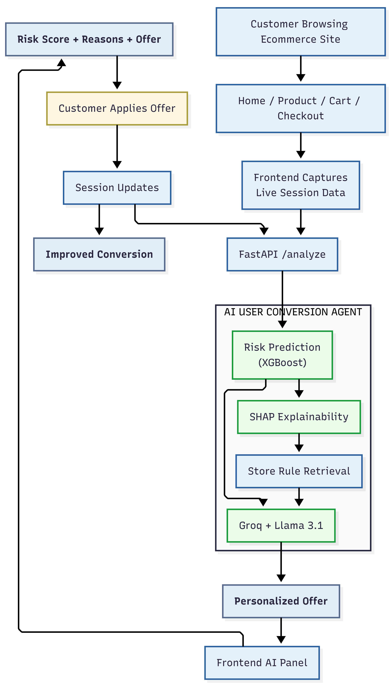
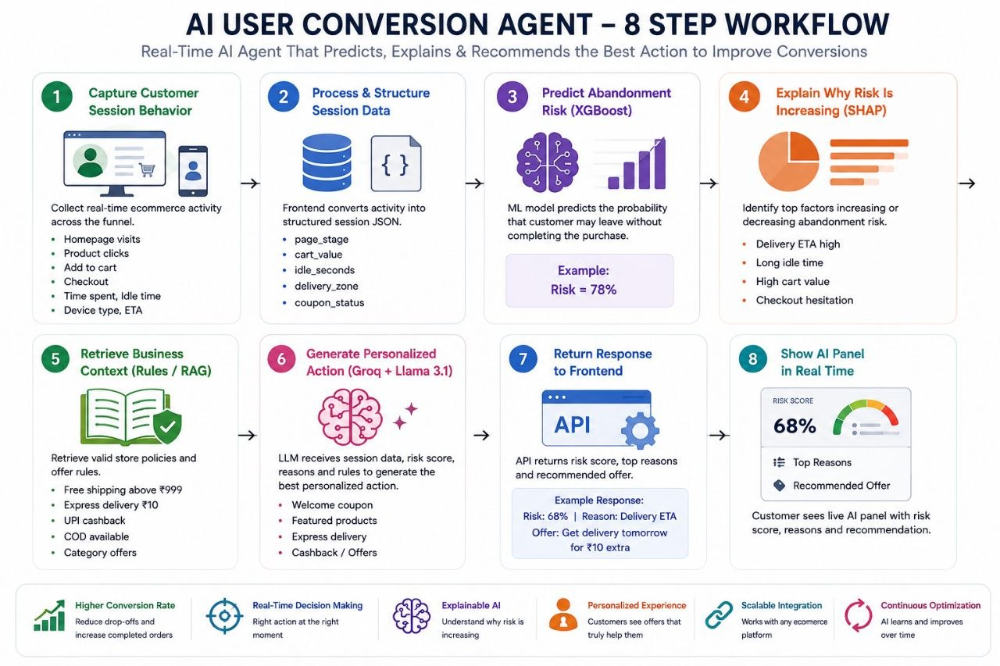

# AI User Conversion Agent  
### Real-Time Ecommerce Customer Conversion & Recovery System

---

## Project Title & Brief Description

AI User Conversion Agent is an intelligent ecommerce AI system designed to improve customer conversions in real time.

Before starting this project, I explored the Steps AI website and the way Steps AI focuses on building practical AI agents for businesses and real-world workflows.

That strongly inspired this idea.

Based on that vision, I wanted to build an AI product that Steps AI can offer to ecommerce companies to improve conversions and reduce customer drop-offs during the buying journey.

In ecommerce, users often:

- visit the homepage
- browse products
- add items to cart
- proceed to checkout

…and then leave without completing the purchase.

This directly impacts:

- **Conversions**
- **Revenue**
- **Customer retention**

Most platforms show generic offers.

But every customer session is different.

AI User Conversion Agent solves this by monitoring the customer journey in real time and generating personalized interventions before the user exits.

The system:

✅ predicts abandonment risk  
✅ explains why risk is increasing  
✅ retrieves valid store rules  
✅ recommends the best personalized action

Examples:

- Welcome coupon
- Featured products
- Free shipping
- Express delivery
- Cashback
- COD suggestion

### Goal

**Help ecommerce businesses increase conversions and reduce users leaving the site without buying.**

---

## Selected Problem Statement

### Open Track – AI Agents for Real World Problems

Domains involved:

- AI Automation
- Analytics
- Business Intelligence
- Intelligent Systems

### Chosen Use Case

## AI User Conversion Agent for Ecommerce

---

## Demo Video Link

[](https://drive.google.com/file/d/1BDFcyP3CTXahxjvHd8w4rOKvTILZdUkb/view?usp=drivesdk)

---

## Tech Stack Used

### Backend

- FastAPI
- Python

### Machine Learning

- XGBoost
- SHAP
- scikit-learn
- pandas
- numpy

### LLM

- Groq Cloud API
- Llama-3.1-8b-instant

### Deployment

- Render
- GitHub

---

## Backend Architecture / System Design

### Architecture Overview

<p align="center">
  
</p>

The system continuously tracks customer activity across the ecommerce journey and predicts the probability of abandonment in real time.

It combines:

- XGBoost risk prediction
- SHAP explainability
- store rule retrieval
- Groq + Llama 3.1 recommendation generation

to return the best personalized action for improving customer conversion.

---

### Workflow

<p align="center">
  
</p>
```

### Live API

Backend deployed on Render:

**API:**  
https://ai-risk-agent.onrender.com

**FastAPI Docs:**  
https://ai-risk-agent.onrender.com/docs

### Demo Ecommerce Site

Built specifically to test the AI system in real time:

**Demo Ecommerce Website:**  
[[Paste deployed ecommerce frontend link](https://demo-site-git-main-kmrahul0206-4780s-projects.vercel.app/)]

---

## Implementation Approach & Workflow

### 1. Synthetic Ecommerce Dataset

Created realistic ecommerce session data using:

- time spent
- page stage
- device type
- delivery zone
- cart value
- cart item count
- delivery ETA
- coupon availability
- returning user
- idle time

---

### 2. Abandonment Risk Prediction

Used **XGBoost**.

Predicts:

```txt
0.0 → Low risk
1.0 → High risk
```

Example:

```txt
0.13 → Low
0.52 → Medium
0.81 → High
```

### Best observed results

```txt
Accuracy: 0.76
ROC AUC: 0.778
```

---

### 3. Explainable AI

Used **SHAP**.

Example:

```txt
delivery_eta_days +0.62
idle_seconds +0.55
cart_value -0.28
```

Positive = increases risk

Negative = reduces risk

---

### 4. Rule Retrieval

Used a lightweight Retrieval-Augmented Generation (RAG) approach.

Store business rules are maintained in JSON and act as the retrieval knowledge base.

Examples:

- express delivery ₹10
- free shipping above ₹999
- WELCOME50
- cashback
- COD

Only valid rules are passed to LLM.

---

### 5. Personalized Recommendation

Using:

- Groq API
- Llama-3.1-8b-instant

Input:

- risk score
- page stage
- top reasons
- rules

Example output:

```json
{
  "action": "express_delivery",
  "message": "Get delivery tomorrow for ₹10 extra."
}
```

---

### 6. Real-Time Frontend Demo

Customer flow:

```txt
Home
→ Product
→ Cart
→ Checkout
```

Frontend calls API live.

UI updates instantly with:

- current page
- risk score
- top reasons
- personalized offer

---

## Features & Functionalities

### Real-Time Risk Prediction

Predicts abandonment instantly.

---

### Explainable AI

Shows why the user may leave.

---

### Personalized Page-Aware Recommendations

Different actions based on:

- Home
- Product
- Cart
- Checkout

---

### Rule-Safe LLM

Recommendations only use valid business rules.

---

### Public REST API

Reusable with any ecommerce frontend.

---

### Live Demo Website

Connected to deployed API.

---

## APIs / Models / Tools Used

### APIs

- Groq API

### Models

- XGBoost
- Llama-3.1-8b-instant

### Tools

- SHAP
- FastAPI
- Render
- GitHub

---

## Setup Instructions to Run Locally

### Clone repository

```bash
git clone https://github.com/kmrahul17/Ai-risk-agent.git
cd Ai-risk-agent
```

---

## Environment Variables Required

Create:

### `.env`

Example:

```env
GROQ_API_KEY=your_groq_api_key_here
```

---

## Installation Steps

### Install dependencies

```bash
pip install -r requirements.txt
```

---

### Train model

```bash
python main.py
```

---

### Test locally

```bash
python test_agent.py
```

---

### Run FastAPI

```bash
python -m uvicorn src.api.app:app --reload
```

Open:

```txt
http://127.0.0.1:8000/docs
```

---


## Author

Built for **Steps AI National Level Online Hackathon 2026**

By

**Karanam Mohan Rahul**
